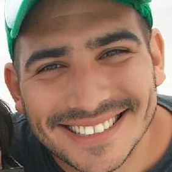

Bienvenidos a
# Buenas, soy Abel García

Soy de Hurlingham, nací en Morón, lugar donde estudie informatica en la EET 6 "Chacabuco".
Conseguí mi primer trabajo formal en informática en 2011 y desde esa epoca que me encuentro en el rubro de la tecnologia.
Estudiando a nivel universitario desde 2006, porque inconstante siempre pero terco tambien :)...
Esperemos poder sumar herramientas a esta mochila informática...

Saludos

```
object programacionConObjetos { 
    method saludar() { 
        return  "Bienvenidxs!" 
    }
}
```
